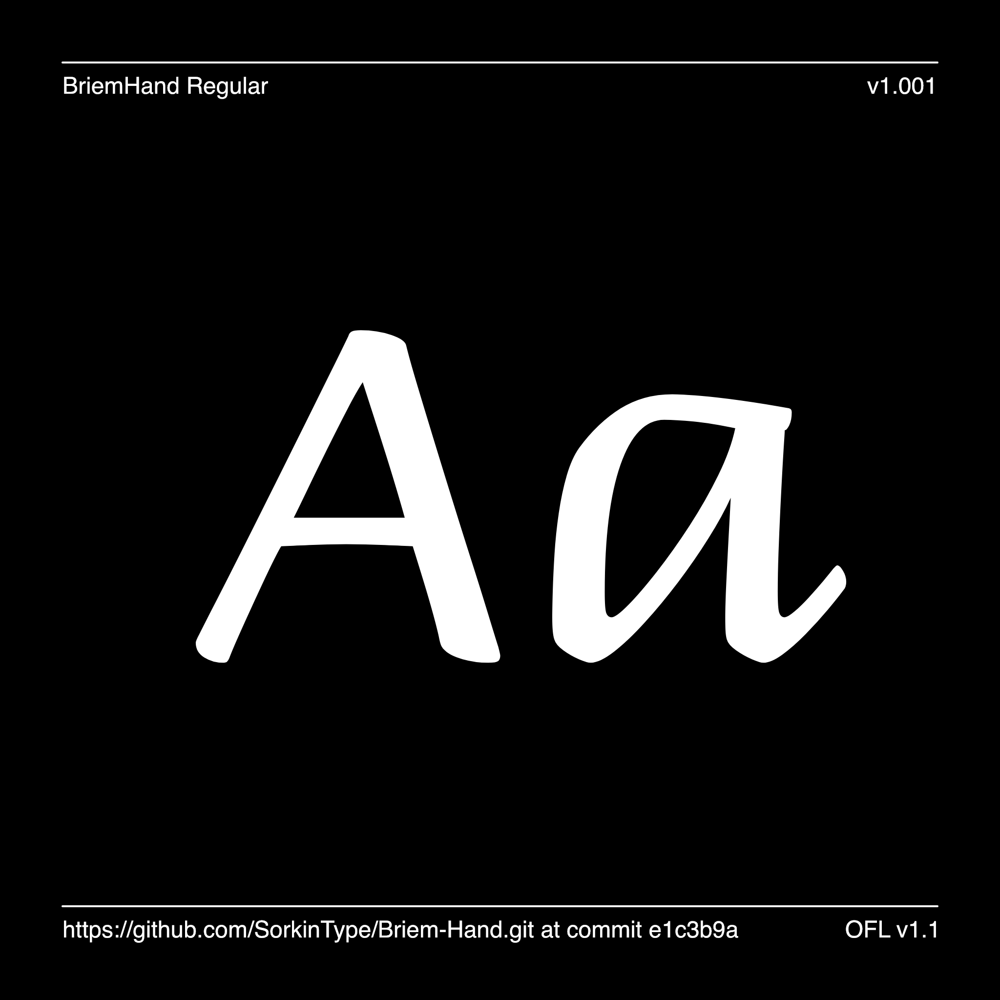

# Briem Print

[![][Fontbakery]](https://SorkinType.github.io/Briem-1/fontbakery/fontbakery-report.html)
[![][Universal]](https://SorkinType.github.io/Briem-1/fontbakery/fontbakery-report.html)
[![][GF Profile]](https://SorkinType.github.io/Briem-1/fontbakery/fontbakery-report.html)
[![][Outline Correctness]](https://SorkinType.github.io/Briem-1/fontbakery/fontbakery-report.html)
[![][Shaping]](https://SorkinType.github.io/Briem-1/fontbakery/fontbakery-report.html)

[Fontbakery]: https://img.shields.io/endpoint?url=https%3A%2F%2Fraw.githubusercontent.com%2FSorkinType%2FBriem-1%2Fgh-pages%2Fbadges%2Foverall.json
[GF Profile]: https://img.shields.io/endpoint?url=https%3A%2F%2Fraw.githubusercontent.com%2FSorkinType%2FBriem-1%2Fgh-pages%2Fbadges%2FGoogleFonts.json
[Outline Correctness]: https://img.shields.io/endpoint?url=https%3A%2F%2Fraw.githubusercontent.com%2FSorkinType%2FBriem-1%2Fgh-pages%2Fbadges%2FOutlineCorrectnessChecks.json
[Shaping]: https://img.shields.io/endpoint?url=https%3A%2F%2Fraw.githubusercontent.com%2FSorkinType%2FBriem-1%2Fgh-pages%2Fbadges%2FShapingChecks.json
[Universal]: https://img.shields.io/endpoint?url=https%3A%2F%2Fraw.githubusercontent.com%2FSorkinType%2FBriem-1%2Fgh-pages%2Fbadges%2FUniversal.json

Briem Hand is one of two related font families. Briem Hand keeps each letter separate and not joined. The other, Briem Script; offers an unusually realistic set of join strokes between the letters which join in handwritten text. Both designs help teach the handwriting system made by Gunnlaugur SE Briem.

See Briem Script: [https://github.com/SorkinType/Briem-Script](https://github.com/SorkinType/Briem-Script)

## About

Gunnlaugur SE Briem is a designer and lives in Spain. His postgraduate studies in Basel and London ended with a PhD from the Royal College of Art. Gunnlaugur SE Briem designed Briem Print. 

Previous Non-Libre versions have been released in the past by Microsoft, Adobe and Monotype.

Sorkin Type Co. is a Massachusetts based font foundry.

## Building

Fonts are built automatically by GitHub Actions - take a look in the "Actions" tab for the latest build.

If you want to build fonts manually on your own computer:

* `make build` will produce font files.
* `make test` will run [FontBakery](https://github.com/googlefonts/fontbakery)'s quality assurance tests.
* `make proof` will generate HTML proof files.

The proof files and QA tests are also available automatically via GitHub Actions - look at https://SorkinType.github.io/Briem-1.

## Changelog

**16 October 2022. Version 1.01**
- MAJOR Font turned to a variable font.
- SIGNIFICANT Kerning added
- SIGNIFICANT Eight interpolated weights instead of two weights
- SIGNIFICANT New lamguage support, additional punctuation, symbols and joining suppport for all of the weights.

This edition of Briem Script supports 431 languages:

Abron, Abua, Acheron, Achinese, Acholi, Achuar-Shiwiar, Adangme, Afar, Afrikaans, Aguaruna, Ahtna, Akoose, Alekano, Aleut, Amahuaca, Amarakaeri, Amis, Anaang, Andaandi, Dongolawi, Anufo, Anuta, Ao Naga, Apinayé, Arabela, Aragonese, Arbëreshë Albanian, Arvanitika Albanian, Asháninka, Ashéninka Perené, Asturian, Asu (Tanzania), Atayal, Awa-Cuaiquer, Awetí, Awing, Ayizo Gbe, Baatonum, Bafia, Balinese, Balkan Romani, Bambara, Baoulé, Bari, Basque, Batak Dairi, Batak Karo, Batak Mandailing, Batak Simalungun, Batak Toba, Bemba (Zambia), Bena (Tanzania), Biali, Bikol, Bini, Bislama, Boko (Benin), Bora, Borana-Arsi-Guji Oromo, Bosnian, Breton, Buginese, Candoshi-Shapra, Caquinte, Caribbean Hindustani, Cashibo-Cacataibo, Cashinahua, Catalan, Cebuano, Central Aymara, Central Kurdish, Central Nahuatl, Chachi, Chamorro, Chavacano, Chayahuita, Chickasaw, Chiga, Chiltepec Chinantec, Chokwe, Chuukese, Cimbrian, Cofán, Congo Swahili, Cook Islands Māori, Cornish, Corsican, Creek, Crimean Tatar, Croatian, Czech, Danish, Dehu, Dendi (Benin), Dimli, Ditammari, Dutch, Dyula, Eastern Abnaki, Eastern Arrernte, Eastern Maninkakan, Eastern Oromo, Efik, Embu, English, Ese Ejja, Ewondo, Falam Chin, Fanti, Faroese, Fe'Fe', Fijian, Filipino, Finnish, Fon, French, Friulian, Ga, Gagauz, Galician, Ganda, Garifuna, Ga’anda, German, Gheg Albanian, Gilbertese, Gonja, Gooniyandi, Guadeloupean Creole French, Gusii, Gwichʼin, Haitian, Hakha Chin, Hani, Hassaniyya, Hawaiian, Hiligaynon, Ho-Chunk, Hopi, Huastec, Hungarian, Hän, Ibibio, Icelandic, Idoma, Igbo, Iloko, Inari Sami, Indonesian, Irish, Istro Romanian, Italian, Ixcatlán Mazatec, Jamaican Creole English, Japanese, Javanese, Jenaama Bozo, Jola-Fonyi, K'iche', Kabuverdianu, Kaingang, Kala Lagaw Ya, Kalaallisut, Kalenjin, Kamba (Kenya), Kanuri, Kaonde, Kaqchikel, Kara-Kalpak, Karelian, Karo, Kashubian, Kekchí, Kenzi, Mattokki, Khasi, Kikuyu, Kimbundu, Kinyarwanda, Kirmanjki, Kituba (DRC), Kongo, Konzo, Koyra Chiini Songhay, Koyraboro Senni Songhai, Krio, Kuanyama, Kven Finnish, Kölsch, Ladin, Ladino, Lakota, Langi, Latgalian, Latin, Ligurian, Lingala, Lithuanian, Lombard, Low German, Lower Sorbian, Lozi, Luba-Katanga, Luba-Lulua, Lule Sami, Luo (Kenya and Tanzania), Luxembourgish, Macedo-Romanian, Madurese, Makhuwa, Makhuwa-Meetto, Makonde, Makwe, Malagasy, Malaysian, Maltese, Mam, Mamara Senoufo, Mandinka, Mandjak, Mankanya, Manx, Maore Comorian, Maori, Mapudungun, Marshallese, Masai, Matsés, Mauritian Creole, Mbelime, Medumba, Megleno Romanian, Mende (Sierra Leone), Meriam Mir, Meru, Meta’, Metlatónoc Mixtec, Mezquital Otomi, Mi'kmaq, Minangkabau, Mirandese, Miyobe, Mizo, Moba, Mohawk, Montenegrin, Munsee, Murrinh-Patha, Murui Huitoto, Muslim Tat, Mwani, Mískito, Naga Pidgin, Nateni, Navajo, Ndonga, Neapolitan, Ngazidja Comorian, Ngiemboon, Ngomba, Niuean, Nobiin, Nomatsiguenga, North Azerbaijani, North Marquesan, North Ndebele, Northern Kissi, Northern Kurdish, Northern Qiandong Miao, Northern Sami, Northern Uzbek, Norwegian, Nyamwezi, Nyanja, Nyankole, Nyemba, Nzima, Occitan, Ojitlán Chinantec, Orma, Oroqen, Otuho, Palauan, Paluan, Pampanga, Papantla Totonac, Papiamento, Paraguayan Guaraní, Pedi, Picard, Pichis Ashéninka, Piemontese, Pijin, Pintupi-Luritja, Pipil, Pite Sami, Pohnpeian, Polish, Portuguese, Potawatomi, Prussian, Purepecha, Páez, Quechua, Romanian, Romansh, Rotokas, Rundi, Rwa, Samburu, Samoan, Sango, Sangu (Tanzania), Saramaccan, Sardinian, Scottish Gaelic, Secoya, Sena, Seri, Seselwa Creole French, Shambala, Sharanahua, Shawnee, Shilluk, Shipibo-Conibo, Shona, Shuar, Sicilian, Silesian, Siona, Skolt Sami, Slovak, Slovenian, Soga, Somali, Soninke, South Azerbaijani, South Marquesan, South Ndebele, Southern Aymara, Southern Dagaare, Southern Qiandong Miao, Southern Sami, Southern Sotho, Spanish, Sranan Tongo, Standard Estonian, Standard Latvian, Standard Malay, Sundanese, Susu, Swahili, Swati, Swedish, Swiss German, Syenara Senoufo, Tagalog, Tahitian, Taita, Talysh, Tasawaq, Tedim Chin, Tetum, Tetun Dili, Tigon Mbembe, Timne, Tiv, Tiéyaxo Bozo, Toba, Tojolabal, Tok Pisin, Tokelau, Tonga (Tonga Islands), Tonga (Zambia), Tosk Albanian, Totontepec Mixe, Tsakhur, Tsonga, Tswana, Tumbuka, Turkish, Turkmen, Tuvalu, Twi, Tzeltal, Tzotzil, Uab Meto, Umbundu, Ume Sami, Upper Guinea Crioulo, Upper Sorbian, Urarina, Venda, Venetian, Veps, Vietnamese, Vlax Romani, Võro, Waama, Wallisian, Walloon, Walser, Wamey, Wangaaybuwan-Ngiyambaa, Waorani, Waray (Philippines), Warlpiri, Wasa, Wayuu, Welsh, West Central Oromo, West-Central Limba, Western Abnaki, Western Frisian, Wik-Mungkan, Wiradjuri, Wolof, Xavánte, Xhosa, Yagua, Yanesha', Yangben, Yanomamö, Yao, Yapese, Yindjibarndi, Yoruba, Yucateco, Zapotec, Zarma, Zulu, Zuni, Záparo

## License

This Font Software is licensed under the SIL Open Font License, Version 1.1.
This license is available with a FAQ at
https://scripts.sil.org/OFL

## Repository Layout

This font repository structure is inspired by [Unified Font Repository v0.3](https://github.com/unified-font-repository/Unified-Font-Repository), modified for the Google Fonts workflow.
